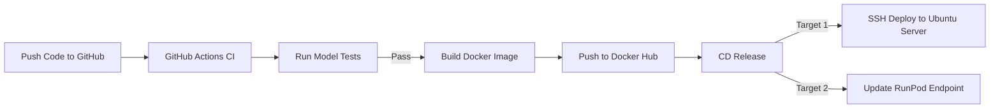

# Production AI Model Deployment Guide

This guide covers two primary methods to deploy your pre-trained AI model application (e.g., Streamlit + YOLO11) using a **Docker configuration**:

1. **Option 1 — Self-Hosted Server** (AWS EC2, DigitalOcean, etc.)
2. **Option 2 — RunPod** (Cloud GPU hosting via interactive Pods or Serverless API)

---

## 1. Unified Configuration Files

Add these two files to the **root of your project directory**:

```text
your-ai-project/
├── model/
│   └── best.pt          ← Your trained model weights
├── pothole.py           ← Streamlit app code
├── requirements.txt     ← Python dependencies
├── Dockerfile           ← Container build instructions
└── docker-compose.yml   ← Container run configuration
```

### Dockerfile

```dockerfile
# Unified Dockerfile: Works for both CPU and GPU deployments
FROM pytorch/pytorch:2.1.0-cuda12.1-cudnn8-runtime

WORKDIR /app
ENV DEBIAN_FRONTEND=noninteractive

# Install system dependencies required by OpenCV (used by YOLO)
RUN apt-get update && apt-get install -y --no-install-recommends \
    libgl1-mesa-glx \
    libglib2.0-0 \
    && rm -rf /var/lib/apt/lists/*

# Copy and install python dependencies
COPY requirements.txt .
RUN pip install --no-cache-dir -r requirements.txt

# Copy model weights and Streamlit app
COPY model/ ./model/
COPY pothole.py .

EXPOSE 8501

CMD ["streamlit", "run", "pothole.py", "--server.port", "8501", "--server.address", "0.0.0.0"]
```

### docker-compose.yml

```yaml
services:
  pothole-app:
    build:
      context: .
      dockerfile: Dockerfile
    container_name: pothole-segmentation-app
    ports:
      - "8501:8501"
    restart: always
    environment:
      - PYTORCH_CUDA_ALLOC_CONF=expandable_segments:True
    # GPU pass-through — delete or comment out the 'deploy' block below
    # if your server does NOT have an NVIDIA GPU (CPU-only servers).
    deploy:
      resources:
        reservations:
          devices:
            - driver: nvidia
              count: all
              capabilities: [gpu]
```

---

## Option 1: Self-Hosted Ubuntu Server Deployment

### Step 1: Configure Docker on the Host

**If your server has an NVIDIA GPU:**
```bash
# Install the NVIDIA display driver
sudo apt update && sudo ubuntu-drivers install && sudo reboot

# Install Docker
sudo apt install -y docker.io && sudo systemctl enable --now docker

# Install the NVIDIA Container Toolkit (bridges GPU into Docker)
curl -fsSL https://nvidia.github.io/libnvidia-container/gpgkey | sudo gpg --dearmor -o /usr/share/keyrings/nvidia-container-toolkit-keyring.gpg \
  && curl -s -L https://nvidia.github.io/libnvidia-container/stable/deb/nvidia-container-toolkit.list | \
    sed 's#deb https://#deb [signed-by=/usr/share/keyrings/nvidia-container-toolkit-keyring.gpg] https://#g' | \
    sudo tee /etc/apt/sources.list.d/nvidia-container-toolkit.list

sudo apt update && sudo apt install -y nvidia-container-toolkit
sudo nvidia-ctk runtime configure --runtime=docker && sudo systemctl restart docker
```

**If your server is CPU-Only (no GPU):**
```bash
sudo apt update && sudo apt install -y docker.io && sudo systemctl enable --now docker
```

> **Note:** For CPU-only servers, also comment out the `deploy:` block inside `docker-compose.yml`. PyTorch will automatically fall back to CPU execution.

---

### Step 2: Build and Launch the Application

SSH into your server, clone your repository, and run:

```bash
# Clone your repository
git clone https://github.com/your-username/your-ai-project.git
cd your-ai-project

# Build the Docker image and start the container in the background
docker compose up -d --build
```

Verify the container is running:
```bash
# View active containers
docker ps

# Tail the application logs
docker logs -f pothole-segmentation-app
```

---

### Step 3: Install Nginx and Certbot

Nginx acts as a reverse proxy to route public internet traffic to your Streamlit container running on port `8501`. Certbot issues a free SSL certificate to enable HTTPS.

```bash
# Install Nginx and Certbot
sudo apt update
sudo apt install -y nginx certbot python3-certbot-nginx

# Start Nginx and enable it to auto-start on server reboot
sudo systemctl start nginx
sudo systemctl enable nginx
```

---

### Step 4: Create the Nginx Server Block

Open a new configuration file:
```bash
sudo nano /etc/nginx/sites-available/pothole-segmentation
```

Paste the following configuration inside the file:
```nginx
server {
    listen 80;
    server_name your-domain.com;  # Replace with your actual domain or server IP

    # Increase upload limit for large image files
    client_max_body_size 50M;

    location / {
        proxy_pass http://localhost:8501;
        proxy_http_version 1.1;
        proxy_set_header Upgrade $http_upgrade;
        proxy_set_header Connection "upgrade";
        proxy_set_header Host $host;
        proxy_cache_bypass $http_upgrade;
        proxy_set_header X-Real-IP $remote_addr;
        proxy_set_header X-Forwarded-For $proxy_add_x_forwarded_for;
        proxy_set_header X-Forwarded-Proto $scheme;
    }
}
```

Save and close the file (`Ctrl+X`, then `Y`, then `Enter`).

---

### Step 5: Enable the Configuration and Restart Nginx

```bash
# Create a symbolic link to activate the site
sudo ln -s /etc/nginx/sites-available/pothole-segmentation /etc/nginx/sites-enabled/

# Test the Nginx configuration for syntax errors
sudo nginx -t

# Restart Nginx to apply changes
sudo systemctl restart nginx
```

---

### Step 6: Issue an SSL Certificate with Certbot

Run Certbot to automatically fetch and install a free Let's Encrypt SSL certificate. This will also configure automatic HTTPS redirection.

```bash
sudo certbot --nginx -d your-domain.com
```

Certbot sets up a background cron job to automatically renew the certificate before it expires. Your application is now live at `https://your-domain.com`.

---

## Option 2: Deploy on RunPod (Cloud GPU Hosting)

RunPod is a cloud GPU platform where you rent GPU instances by the hour, with no upfront hardware costs.

### Method A: RunPod Pods (Persistent & Interactive Workspace)

Best for active testing, Streamlit dashboards, and running apps persistently.

1. **Create Template:** In the RunPod Console go to **Templates → New Template**. Set the base image to `runpod/pytorch:2.1.0-py3.10-cuda11.8.0-devel-ubuntu22.04`. Expose HTTP port `8501`.
2. **Deploy Pod:** Under **GPU Cloud**, select a GPU (e.g., RTX 4090), choose your Template, allocate a **Network Volume** (to persist data across restarts), and launch.
3. **Setup and Run:**
   ```bash
   # Inside Jupyter Lab terminal or SSH session
   cd /workspace
   git clone <your-repo-link>
   cd <your-repo-folder>
   pip install -r requirements.txt

   # Launch the app
   streamlit run pothole.py --server.port 8501 --server.address 0.0.0.0
   ```
4. **Access:** In the RunPod Console, click **Connect → HTTP Service [Port 8501]** to open your live Streamlit app URL.

---

### Method B: RunPod Serverless (Autoscaling API)

Best for production APIs with variable traffic. Scales to **$0 cost** when idle.

1. **Create a handler script (`handler.py`):** Use the `runpod` Python SDK to accept API calls, decode base64 images, run your YOLO model, and return results as JSON.
2. **Build and push your Docker image:**
   ```bash
   docker build -t yourusername/yolo11-pothole:latest .
   docker push yourusername/yolo11-pothole:latest
   ```
3. **Configure Endpoint:** In the RunPod Console go to **Serverless → Endpoints → New Endpoint**. Enter your Docker image tag and set **Min Workers to 0** (saves cost when idle).
4. **Invoke:** RunPod provides a unique HTTPS endpoint URL. Send POST requests with your image payload to get predictions back.

---

## 3. CI/CD Pipeline for AI Deployment

CI/CD for AI differs from regular web apps because it must handle **code, dependencies, and model weights** together.



> **Key Rule on Model Weights:** Never commit large `.pt` weight files to GitHub. Store them in a cloud bucket (AWS S3, Google Cloud Storage) or a model registry (MLflow, DVC). During CI, the build runner downloads them and bakes them into the Docker image.

### GitHub Actions Workflow (`.github/workflows/deploy.yml`)

```yaml
name: AI Model Deployment CI/CD

on:
  push:
    branches:
      - main

jobs:
  # Job 1: Test the Model
  test-model:
    runs-on: ubuntu-latest
    steps:
      - name: Checkout Repository
        uses: actions/checkout@v3

      - name: Set up Python
        uses: actions/setup-python@v4
        with:
          python-version: '3.10'

      - name: Install Dependencies
        run: |
          pip install -r requirements.txt
          pip install pytest

      - name: Run Model Tests
        run: |
          # Verifies the model loads and produces predictions without errors
          pytest tests/test_model.py

  # Job 2: Build and Push Docker Image
  build-and-push-docker:
    needs: test-model
    runs-on: ubuntu-latest
    steps:
      - name: Checkout Repository
        uses: actions/checkout@v3

      - name: Login to Docker Hub
        uses: docker/login-action@v2
        with:
          username: ${{ secrets.DOCKERHUB_USERNAME }}
          password: ${{ secrets.DOCKERHUB_TOKEN }}

      - name: Build and Push Image
        uses: docker/build-push-action@v4
        with:
          context: .
          push: true
          tags: ${{ secrets.DOCKERHUB_USERNAME }}/pothole-segmentation-app:latest

  # Job 3: Deploy to Ubuntu Server via SSH
  deploy-to-server:
    needs: build-and-push-docker
    runs-on: ubuntu-latest
    steps:
      - name: SSH Deploy to Host
        uses: appleboy/ssh-action@v0.1.10
        with:
          host: ${{ secrets.SERVER_IP }}
          username: ${{ secrets.SERVER_USER }}
          key: ${{ secrets.SERVER_SSH_KEY }}
          script: |
            cd /home/ubuntu/your-ai-project
            git pull origin main
            docker compose pull
            docker compose up -d --build
```

---

## 4. Deployment Decision Matrix

| Metric | Self-Hosted Server (GPU) | Self-Hosted Server (CPU) | RunPod Pods | RunPod Serverless |
| :--- | :--- | :--- | :--- | :--- |
| **Inference Speed** | Ultra-Fast (~10–30ms) | Medium (~100–300ms) | Ultra-Fast (~10–30ms) | Ultra-Fast (~10–30ms) |
| **Monthly Cost** | Fixed ($40–$100+/mo) | Fixed ($5–$20/mo) | Hourly billing | Pay-per-second |
| **Idle Cost** | Always billed | Always billed | Always billed | **$0.00 when idle** |
| **Autoscaling** | Manual | Manual | Manual resize | **Automatic (0 → N)** |
| **Best For** | Constant production traffic | Low-traffic or budget | Development & dashboards | Variable/spike API traffic |
