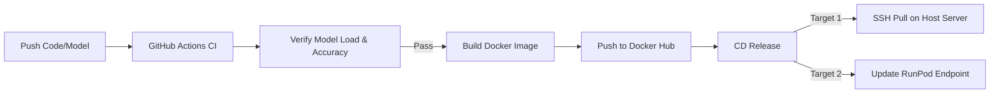

# Production AI Model Deployment Guide

This guide details the two primary methods to deploy your pre-trained AI model application (e.g., Streamlit + YOLO11) using a **single Docker configuration**:
1. **Deploying on a Self-Hosted Server** (e.g., Ubuntu on AWS EC2, DigitalOcean, etc.)
2. **Deploying on RunPod** (Cloud GPU hosting via interactive Pods or Serverless API)

---

## 1. Unified Configuration Files

Save these files in the root of your project directory (`your-ai-project/`):

### Dockerfile
Saved as [Dockerfile](file:///c:/Users/Saiful%20Islam/github/deployment/AI-Deployment/Dockerfile):
```dockerfile
# Unified Dockerfile: Works for both CPU and GPU deployments
FROM pytorch/pytorch:2.1.0-cuda12.1-cudnn8-runtime

WORKDIR /app
ENV DEBIAN_FRONTEND=noninteractive

# Install system dependencies required by OpenCV
RUN apt-get update && apt-get install -y --no-install-recommends \
    libgl1-mesa-glx \
    libglib2.0-0 \
    && rm -rf /var/lib/apt/lists/*

# Copy python dependencies and install
COPY requirements.txt .
RUN pip install --no-cache-dir -r requirements.txt

# Copy model weights and Streamlit application code
COPY model/ ./model/
COPY pothole.py .

# Streamlit default port is 8501
EXPOSE 8501

# Start the Streamlit application
CMD ["streamlit", "run", "pothole.py", "--server.port", "8501", "--server.address", "0.0.0.0"]
```

### Docker Compose
Saved as [docker-compose.yml](file:///c:/Users/Saiful%20Islam/github/deployment/AI-Deployment/docker-compose.yml):
```yaml
services:
  pothole-app:
    build:
      context: .
      dockerfile: Dockerfile
    container_name: pothole-segmentation-app
    ports:
      - "8501:8501"
    restart: always
    environment:
      - PYTORCH_CUDA_ALLOC_CONF=expandable_segments:True
    # Pass host NVIDIA GPU to the container if available on the server.
    # Note: If your server does not have a GPU (CPU-only), delete or comment out the 'deploy' section below.
    deploy:
      resources:
        reservations:
          devices:
            - driver: nvidia
              count: all
              capabilities: [gpu]
```

---

## Step 1: Deploy on a Self-Hosted Server (AWS, DigitalOcean, etc.)

Follow these steps to deploy on your own Ubuntu server using Docker:

### 1. Configure the Host Server
* **If your server HAS an NVIDIA GPU:**
  Install NVIDIA drivers and the NVIDIA Container Toolkit to bridge the GPU into Docker:
  ```bash
  # Install Drivers
  sudo apt update && sudo ubuntu-drivers install && sudo reboot
  
  # Install Docker
  sudo apt install -y docker.io && sudo systemctl enable --now docker
  
  # Install NVIDIA Container Toolkit
  curl -fsSL https://nvidia.github.io/libnvidia-container/gpgkey | sudo gpg --dearmor -o /usr/share/keyrings/nvidia-container-toolkit-keyring.gpg \
    && curl -s -L https://nvidia.github.io/libnvidia-container/stable/deb/nvidia-container-toolkit.list | \
      sed 's#deb https://#deb [signed-by=/usr/share/keyrings/nvidia-container-toolkit-keyring.gpg] https://#g' | \
      sudo tee /etc/apt/sources.list.d/nvidia-container-toolkit.list
  sudo apt update && sudo apt install -y nvidia-container-toolkit
  sudo nvidia-ctk runtime configure --runtime=docker && sudo systemctl restart docker
  ```
* **If your server is CPU-Only (No GPU):**
  Simply install Docker:
  ```bash
  sudo apt update && sudo apt install -y docker.io && sudo systemctl enable --now docker
  ```

### 2. Launch the Application
1. SSH into your server, clone your repository, and copy the `Dockerfile` and `docker-compose.yml` into your project root folder.
2. Run the deployment command:
   * **If GPU is present:**
     ```bash
     docker compose up -d --build
     ```
   * **If CPU-Only:**
     Comment out the `deploy:` block (lines 13-20) in `docker-compose.yml`, then run:
     ```bash
     docker compose up -d --build
     ```
     *Note: PyTorch will automatically detect that no CUDA device is available and fall back to CPU execution.*

---

## Step 2: Deploy on RunPod (Cloud GPU Hosting)

RunPod is a cloud GPU platform where you can deploy your container using two methods:

### Method A: RunPod Pods (Persistent & Interactive Workspace)
Best for active testing and running persistent apps.

1. **Create Template:** In the RunPod Console, go to **Templates** -> **New Template**. Set the base image to `runpod/pytorch:2.1.0-py3.10-cuda11.8.0-devel-ubuntu22.04` (or any PyTorch CUDA image). Expose HTTP port `8501`.
2. **Deploy Pod:** Choose a GPU (e.g. RTX 4090) under **GPU Cloud**, select your Template, allocate a persistent **Network Volume**, and launch.
3. **Setup and Run:**
   - Once running, click **Connect** -> **Connect to Jupyter Lab** (or connect via SSH).
   - In the Jupyter terminal, move to the workspace network volume, clone your repo, and install packages:
     ```bash
     cd /workspace
     git clone <your-repo-link>
     cd <your-repo-folder>
     pip install -r requirements.txt
     ```
   - Start Streamlit:
     ```bash
     streamlit run pothole.py --server.port 8501 --server.address 0.0.0.0
     ```
   - Access the application in your browser by clicking **Connect** -> **HTTP Service [Port 8501]** in the RunPod Console.

### Method B: RunPod Serverless (Autoscaling Web API)
Best for production web applications where traffic fluctuates and you want to scale down to **$0 cost** when idle.

1. **Create a Serverless Handler (`handler.py`):**
   Use the `runpod` python SDK to receive API calls, decode base64 images, execute your model, and return coordinates/results.
2. **Build and Push Docker Image:**
   Write a Dockerfile using your handler script and model weights. Build it and push it to a public registry:
   ```bash
   docker build -t yourusername/yolo11-pothole:latest .
   docker push yourusername/yolo11-pothole:latest
   ```
3. **Deploy Endpoint:** In the RunPod Console, go to **Serverless** -> **Endpoints** -> **New Endpoint**. Enter your Docker image tag, set **Min Workers to 0** (so it shuts down when not in use), and set your desired GPU type.
4. **Interact:** RunPod generates a unique API URL. Send post requests containing your image payloads to get model predictions back.

---

## 3. CI/CD Pipeline for AI Deployment

Continuous Integration and Continuous Deployment (CI/CD) for AI differs from standard web apps because it must handle **Code, Data, and Model Weights** collectively.



### Key Concept: Where do Model Weights live?
* **Avoid pushing weights (`.pt` files) to GitHub:** Large files (50MB - 10GB+) slow down Git repositories.
* **Best Practice:** Store model weights in a cloud bucket (AWS S3, Google Cloud Storage) or a model registry (MLflow, DVC).
* **Pipeline Action:** During the Docker build step in CI, the runner downloads the weights from your cloud storage and bakes them directly into the container image.

---

### Production CI/CD Workflow (GitHub Actions)
Create this file in your repository as `.github/workflows/deploy.yml` to automate testing, building, and deploying:

```yaml
name: AI Model Deployment CI/CD

on:
  push:
    branches:
      - main

jobs:
  # Job 1: Test the Model
  test-model:
    runs-on: ubuntu-latest
    steps:
      - name: Checkout Repository
        uses: actions/checkout@v3

      - name: Set up Python
        uses: actions/setup-python@v4
        with:
          python-version: '3.10'

      - name: Install dependencies
        run: |
          pip install -r requirements.txt
          pip install pytest

      - name: Test Model Load & Inference Integrity
        run: |
          # Runs python unit tests to verify the model loads and predicts without runtime errors
          pytest tests/test_model.py

  # Job 2: Build & Package Container
  build-and-push-docker:
    needs: test-model
    runs-on: ubuntu-latest
    steps:
      - name: Checkout Repository
        uses: actions/checkout@v3

      - name: Login to Docker Hub
        uses: docker/login-action@v2
        with:
          username: ${{ secrets.DOCKERHUB_USERNAME }}
          password: ${{ secrets.DOCKERHUB_TOKEN }}

      - name: Build and Push Docker Image
        uses: docker/build-push-action@v4
        with:
          context: .
          push: true
          tags: ${{ secrets.DOCKERHUB_USERNAME }}/pothole-segmentation-app:latest

  # Job 3: Deploy to Ubuntu Host Server
  deploy-to-server:
    needs: build-and-push-docker
    runs-on: ubuntu-latest
    steps:
      - name: SSH Deploy to Host
        uses: appleboy/ssh-action@v0.1.10
        with:
          host: ${{ secrets.SERVER_IP }}
          username: ${{ secrets.SERVER_USER }}
          key: ${{ secrets.SERVER_SSH_KEY }}
          script: |
            cd /home/ubuntu/your-ai-project
            # Pull latest code and updated compose configs
            git pull origin main
            # Pull the newly compiled docker image
            docker compose pull
            # Restart container stack with zero downtime
            docker compose up -d --build
```

---

## 4. Deployment Decision Matrix

| Metric | Option A: GPU-Enabled Server (Docker) | Option B: CPU-Only Server (Docker) |
| :--- | :--- | :--- |
| **Inference Latency** | **Ultra-Fast** (~10ms - 30ms per query) | **Medium** (~100ms - 300ms per query) |
| **Ideal For** | High traffic, live video streams | Low-medium traffic, image uploads |
| **Monthly Cost** | Higher ($40 - $100+/mo minimum) | Lower ($5 - $20/mo minimum) |
| **Setup Complexity** | Medium (requires Nvidia drivers & toolkit) | **Low** (requires only standard Docker) |
| **PyTorch Size** | ~2.0 GB (includes CUDA wheels) | **~150 MB** (compact, CPU-only wheels) |

