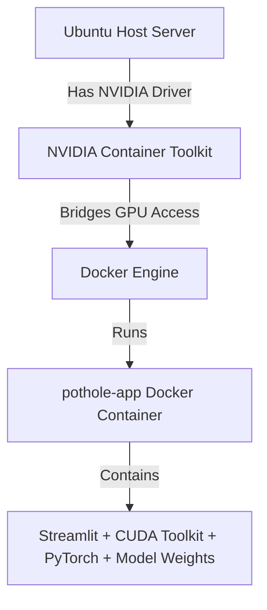
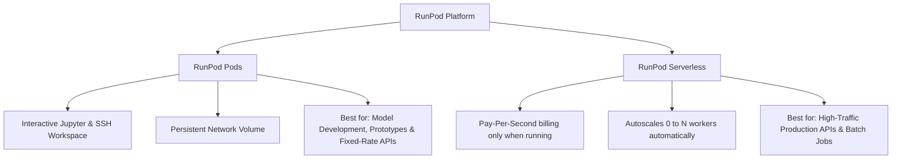
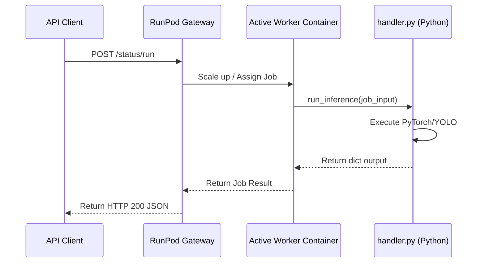

# Production AI Model Deployment Guide: Ubuntu Server & RunPod

This comprehensive guide outlines the step-by-step production deployment workflow for AI models. It covers self-hosted Ubuntu server setups (highlighting the highly recommended **Docker** approach) and scalable Cloud GPU deployments using **RunPod** (both persistent Pods and Serverless configurations).

---

## Table of Contents
1. [Part 1: Self-Hosted Ubuntu Server Deployment](#part-1-self-hosted-ubuntu-server-deployment)
   - [1.1 Hardware & OS Pre-requirements](#11-hardware-os-pre-requirements)
   - [1.2 Driver Setup on Ubuntu Host (NVIDIA GPU)](#12-driver-setup-on-ubuntu-host-nvidia-gpu)
   - [1.3 RECOMMENDED PATH: Docker-Based GPU Deployment (Simple & Clean)](#13-recommended-path-docker-based-gpu-deployment-simple-clean)
   - [1.4 ALTERNATIVE PATH: Bare-Metal Setup (Conda & Systemd)](#14-alternative-path-bare-metal-setup-conda-systemd)
   - [1.5 Production Reverse Proxy & SSL (Nginx & Certbot)](#15-production-reverse-proxy-ssl-nginx-certbot)
2. [Part 2: RunPod Cloud GPU Deployment](#part-2-runpod-cloud-gpu-deployment)
   - [2.1 Platform Overview](#21-platform-overview)
   - [2.2 GPU Selection & Pricing Guide](#22-gpu-selection-pricing-guide)
   - [2.3 Method A: Deploying on RunPod Pods (Persistent Compute)](#23-method-a-deploying-on-runpod-pods-persistent-compute)
   - [2.4 Method B: Deploying on RunPod Serverless (Autoscaling API)](#24-method-b-deploying-on-runpod-serverless-autoscaling-api)
3. [Part 3: Deployment Decision Matrix](#part-3-deployment-decision-matrix)

---

## Part 1: Self-Hosted Ubuntu Server Deployment

Deploying on a dedicated or virtual private Ubuntu server is ideal for constant baseline workloads, low latency, data privacy compliance, and situations where you have on-premises GPU hardware.

### 1.1 Hardware & OS Pre-requirements

Before deploying your AI models (such as YOLO11, Llama, or Stable Diffusion), ensure your server matches the following specifications:

| Resource | Minimum Requirement | Recommended (Production) | Description |
| :--- | :--- | :--- | :--- |
| **OS** | Ubuntu 22.04 LTS | Ubuntu 24.04 LTS (x86_64) | LTS releases ensure system stability and security patches. |
| **CPU** | 4 vCPUs | 8+ vCPUs | Needed for handling concurrent HTTP requests and data pre/post-processing. |
| **RAM** | 16 GB | 32 GB or more | AI models are loaded into system RAM first before being copied to GPU VRAM. |
| **Storage** | 100 GB NVMe SSD | 500 GB+ NVMe SSD | Model weights (PyTorch/YOLO/LLMs), PyPI packages, and Docker layers consume substantial disk space. |
| **Network** | 100 Mbps symmetric | 1 Gbps+ symmetric | Low-latency inference serving and fast model weight downloading from Hugging Face/S3. |

### 1.2 Driver Setup on Ubuntu Host (NVIDIA GPU)

To allow applications inside or outside Docker to communicate with your physical GPU, you **must** install the proprietary NVIDIA graphics drivers on the host machine.

#### Step 1: Clean existing installations (if any)
```bash
sudo apt-get purge nvidia* -y
sudo apt-get autoremove -y
```

#### Step 2: Install Nvidia Driver via Ubuntu Repository
Select the latest stable proprietary driver (e.g., version 550 or newer).
```bash
# Update repository index
sudo apt update && sudo apt upgrade -y

# Check available drivers
ubuntu-drivers devices

# Install recommended driver
sudo ubuntu-drivers install

# Reboot system to load kernel modules
sudo reboot
```

#### Step 3: Verify Installation
Verify that the host successfully recognizes your graphics card:
```bash
nvidia-smi
```

---

### 1.3 RECOMMENDED PATH: Docker-Based GPU Deployment (Simple & Clean)

Instead of manually installing CUDA SDKs, virtual environments, and python packages onto the host machine, you can run the entire model inside a container. The host machine **only** needs the NVIDIA driver, Docker, and the **NVIDIA Container Toolkit** to pass GPU access directly into the container.



#### Step 1: Install Docker on the Host
If Docker is not already installed on your Ubuntu server:
```bash
sudo apt-get update
sudo apt-get install -y docker.io
sudo systemctl enable --now docker
```

#### Step 2: Install the NVIDIA Container Toolkit
This toolkit allows Docker containers to utilize the host's NVIDIA GPUs.

1. Configure the package repository:
   ```bash
   curl -fsSL https://nvidia.github.io/libnvidia-container/gpgkey | sudo gpg --dearmor -o /usr/share/keyrings/nvidia-container-toolkit-keyring.gpg \
     && curl -s -L https://nvidia.github.io/libnvidia-container/stable/deb/nvidia-container-toolkit.list | \
       sed 's#deb https://#deb [signed-by=/usr/share/keyrings/nvidia-container-toolkit-keyring.gpg] https://#g' | \
       sudo tee /etc/apt/sources.list.d/nvidia-container-toolkit.list
   ```
2. Update repository indexes and install the package:
   ```bash
   sudo apt-get update
   sudo apt-get install -y nvidia-container-toolkit
   ```
3. Configure the Docker runtime to use NVIDIA container modules:
   ```bash
   sudo nvidia-ctk runtime configure --runtime=docker
   ```
4. Restart Docker to apply configuration:
   ```bash
   sudo systemctl restart docker
   ```

#### Step 3: Write your Dockerfile (`Dockerfile`)
This packages the Streamlit interface, PyTorch, CUDA libraries, and YOLO11 model weights. Save this in your project root:
```dockerfile
# Use PyTorch with CUDA runtime base image
FROM pytorch/pytorch:2.1.0-cuda12.1-cudnn8-runtime

WORKDIR /app
ENV DEBIAN_FRONTEND=noninteractive

# Install system dependencies required by OpenCV (used under the hood by YOLO)
RUN apt-get update && apt-get install -y --no-install-recommends \
    libgl1-mesa-glx \
    libglib2.0-0 \
    && rm -rf /var/lib/apt/lists/*

# Copy requirements and install
COPY requirements.txt .
RUN pip install --no-cache-dir -r requirements.txt

# Copy model files and Streamlit application code
COPY model/ ./model/
COPY pothole.py .

# Streamlit default port is 8501
EXPOSE 8501

# Start Streamlit application
CMD ["streamlit", "run", "pothole.py", "--server.port", "8501", "--server.address", "0.0.0.0"]
```

#### Step 4: Write your Docker Compose File (`docker-compose.yml`)
Using Docker Compose is the cleanest way to define port mapping, restart policies, environment variables, and GPU allocation rules. Save this in your project root:
```yaml
services:
  pothole-app:
    build:
      context: .
      dockerfile: Dockerfile
    container_name: pothole-segmentation-app
    ports:
      - "8501:8501"
    restart: always
    environment:
      - PYTORCH_CUDA_ALLOC_CONF=expandable_segments:True
    # Pass host NVIDIA GPU to the container
    deploy:
      resources:
        reservations:
          devices:
            - driver: nvidia
              count: all
              capabilities: [gpu]
```

#### Step 5: Build and Run the App on the Server
On your server, run the following single command in the project directory to build and start your application in the background:
```bash
docker compose up -d --build
```

Verify that the container is running and utilizing the GPU:
```bash
# Check container logs to verify Streamlit booted correctly
docker logs pothole-segmentation-app

# Verify GPU utilization inside the container
docker exec -it pothole-segmentation-app python -c "import torch; print('CUDA Available:', torch.cuda.is_available())"
# Expected Output: CUDA Available: True
```

---

### 1.4 ALTERNATIVE PATH: Bare-Metal Setup (Conda & Systemd)

If you do not want to use Docker, you must set up CUDA libraries, Python environments, and process managers directly on the host machine.

#### Step 1: Install CUDA Toolkit on Host
```bash
wget https://developer.download.nvidia.com/compute/cuda/repos/ubuntu2204/x86_64/cuda-keyring_1.1-1_all.deb
sudo dpkg -i cuda-keyring_1.1-1_all.deb
sudo apt-get update
sudo apt-get -y install cuda-toolkit-12-4
```
Edit your `~/.bashrc`:
```bash
echo 'export PATH=/usr/local/cuda-12.4/bin${PATH:+:${PATH}}' >> ~/.bashrc
echo 'export LD_LIBRARY_PATH=/usr/local/cuda-12.4/lib64${LD_LIBRARY_PATH:+:${LD_LIBRARY_PATH}}' >> ~/.bashrc
source ~/.bashrc
```

#### Step 2: Install Miniconda & Create Environment
```bash
mkdir -p ~/miniconda3
wget https://repo.anaconda.com/miniconda/Miniconda3-latest-Linux-x86_64.sh -O ~/miniconda3/miniconda.sh
bash ~/miniconda3/miniconda.sh -b -u -p ~/miniconda3
rm -rf ~/miniconda3/miniconda.sh
~/miniconda3/bin/conda init bash
source ~/.bashrc

conda create -n ai-deployment python=3.10 -y
conda activate ai-deployment
```

#### Step 3: Install PyTorch & Dependencies
```bash
pip3 install torch torchvision torchaudio --index-url https://download.pytorch.org/whl/cu121
pip install streamlit ultralytics pillow
```

#### Step 4: Configure Systemd Process Manager
Create `/etc/systemd/system/pothole-streamlit.service`:
```ini
[Unit]
Description=Pothole Instance Segmentation Streamlit Application
After=network.target

[Service]
User=ubuntu
WorkingDirectory=/home/ubuntu/pothole-instance-segmentation-yolo11-streamlit
Environment="PATH=/home/ubuntu/miniconda3/envs/ai-deployment/bin"
Environment="PYTORCH_CUDA_ALLOC_CONF=expandable_segments:True"
ExecStart=/home/ubuntu/miniconda3/envs/ai-deployment/bin/streamlit run pothole.py --server.port 8501 --server.address 127.0.0.1

Restart=always
RestartSec=5

[Install]
WantedBy=multi-user.target
```
Enable and run:
```bash
sudo systemctl daemon-reload
sudo systemctl start pothole-streamlit
sudo systemctl enable pothole-streamlit
```

---

### 1.5 Production Reverse Proxy & SSL (Nginx & Certbot)

Regardless of whether you choose the **Docker path** (port `8501`) or the **Bare-Metal path** (port `8501`), you should expose your service to the web securely using **Nginx** and **Certbot**.

#### Step 1: Install Nginx
```bash
sudo apt install nginx -y
```

#### Step 2: Configure Server Block
Create Nginx configuration `/etc/nginx/sites-available/pothole-app`:
```nginx
server {
    listen 80;
    server_name app.yourdomain.com; # Replace with your domain or IP

    # Set maximum upload size
    client_max_body_size 50M;

    location / {
        proxy_pass http://127.0.0.1:8501;
        proxy_http_version 1.1;
        proxy_set_header Upgrade $http_upgrade;
        proxy_set_header Connection 'upgrade';
        proxy_set_header Host $host;
        proxy_cache_bypass $http_upgrade;
        proxy_set_header X-Real-IP $remote_addr;
        proxy_set_header X-Forwarded-For $proxy_add_x_forwarded_for;
        proxy_set_header X-Forwarded-Proto $scheme;
    }
}
```

Enable config and restart:
```bash
sudo ln -s /etc/nginx/sites-available/pothole-app /etc/nginx/sites-enabled/
sudo nginx -t
sudo systemctl restart nginx
```

#### Step 3: Secure Traffic with SSL
```bash
sudo apt install certbot python3-certbot-nginx -y
sudo certbot --nginx -d app.yourdomain.com
```

---

## Part 2: RunPod Cloud GPU Deployment

**RunPod** is a cloud GPU computing platform tailored for machine learning workloads, offering significant savings compared to traditional cloud providers.



### 2.1 Platform Overview
RunPod offers two distinct hosting modes:
1. **Pods (Secure & Community Clouds):** Rented compute instances by the hour. These provide full OS access (Jupyter, SSH) and maintain local disk files during execution.
2. **Serverless Endpoints:** Serverless computing where your Docker container runs on-demand. You are only billed per second of active execution, which scales down to $0 when idle.

---

### 2.2 GPU Selection & Pricing Guide

Choosing the right GPU depends heavily on the model task and size (parameter count). Over-allocating wasting money, while under-allocating triggers Out-Of-Memory (OOM) failures.

#### GPU Resource Matrix

| GPU Name | VRAM | Avg. Price/Hr (On-Demand) | Best For | Model Examples |
| :--- | :--- | :--- | :--- | :--- |
| **NVIDIA RTX 4090** | 24 GB | ~$0.79 - $0.89 | Image generation, Computer Vision, light LLMs, and medium fine-tuning. | Stable Diffusion XL, YOLO11, Llama-3-8B (FP16) |
| **NVIDIA L4** | 24 GB | ~$0.55 - $0.65 | Efficient inference workloads. Uses Ada Lovelace Tensor Cores. | YOLO v8/11, BERT, Llama-3-8B (INT8/FP16) |
| **NVIDIA RTX A6000** | 48 GB | ~$1.20 - $1.40 | Large image generation batches, heavy computer vision, mid-sized LLMs. | Stable Diffusion Cascade, Llama-3-8B / 70B (AWQ) |
| **NVIDIA A100 (SXM)** | 80 GB | ~$2.20 - $2.50 | Enterprise LLM serving, complex deep learning training and massive datasets. | Llama-3-70B (FP16), DeepSeek Coder 33B |
| **NVIDIA H100 (SXM)**| 80 GB | ~$3.80 - $4.70 | Ultra-fast inference, state-of-the-art LLM pretraining / LoRA fine-tuning. | Llama-3-70B, DeepSeek-V3/R1 |

#### Community Cloud vs. Secure Cloud
- **Secure Cloud:** Hosted in Tier 3/4 enterprise data centers. Guaranteed reliability, high network speeds, and strict security compliance.
- **Community Cloud:** Peer-to-peer hosting model where individuals rent out their GPUs. Up to **50% cheaper** than Secure Cloud, but carries a small risk of sudden interruptions or lower internet bandwidth. Use for dev environments only.

---

### 2.3 Method A: Deploying on RunPod Pods (Persistent Compute)

RunPod Pods provide a dedicated, persistent environment. This workflow walks through deploying interactive tools like Streamlit.

#### Step 1: Choose or Create Template
1. Log into the RunPod Console.
2. Navigate to **Templates** -> **New Template**.
3. Set the base image to `runpod/pytorch:2.1.0-py3.10-cuda11.8.0-devel-ubuntu22.04` (or any modern PyTorch tag).
4. Under **Container Disk**, set the capacity to `20 GB`, and **Volume Disk** to `50 GB` (stored persistently).
5. Open ports: Expose port `8501` (default for Streamlit) or `8000` (for FastAPI).

#### Step 2: Deploy Pod with Persistent Volume
1. Go to **GPU Cloud**, select your target GPU (e.g., RTX 4090), and click **Deploy**.
2. Make sure you select your custom Template and allocate a **Network Volume** to compile data. Network Volumes store data independently of your Pod instance, meaning that even if the GPU instance terminates, your weights and code are preserved.
3. Launch the pod.

#### Step 3: Run Setup via Jupyter Lab
1. Once the Pod status displays `Running`, click **Connect**.
2. Select **Connect to Jupyter Lab Port 8888** or connect via **SSH**.
3. Create a workspace folder within the `/workspace` directory (since `/workspace` is mounted directly to your persistent Network Volume).
4. Run:
   ```bash
   cd /workspace
   git clone https://github.com/your-username/pothole-instance-segmentation-yolo11-streamlit.git
   cd pothole-instance-segmentation-yolo11-streamlit
   pip install -r requirements.txt
   ```

#### Step 4: Expose Streamlit Port
Start Streamlit listening on port `8501`:
```bash
streamlit run pothole.py --server.port 8501 --server.address 0.0.0.0
```
In the RunPod console, find your running pod and click the **Connect** button, then select **HTTP Service [Port 8501]**. RunPod will route traffic through their reverse proxy secure URL to show your streamlit application dashboard publicly.

---

### 2.4 Method B: Deploying on RunPod Serverless (Autoscaling API)

RunPod Serverless handles autoscaling automatically and features a pay-per-second model. This works by packaging your model as a containerized Docker image with a specific python handler function.



#### Step 1: Create a Serverless Handler (`handler.py`)
RunPod's serverless agent listens for incoming API jobs and passes input data to the python handler.

```python
# handler.py
import os
import io
import base64
import runpod
from PIL import Image
from ultralytics import YOLO

# Global declaration: Load model on container boot to prevent reload delays during active requests
device = "cuda"
model = None

def init_model():
    global model
    if model is None:
        # Load weights from a relative directory inside the Docker image
        model_path = os.getenv("MODEL_PATH", "model/best.pt")
        model = YOLO(model_path).to(device)

def run_inference(job):
    """
    Called by RunPod for every incoming API request.
    job["input"] contains the JSON data sent by the client.
    """
    # Initialize model if not already loaded
    init_model()
    
    # Extract input payload parameters
    job_input = job.get("input", {})
    image_base64 = job_input.get("image_base64")
    confidence = job_input.get("confidence", 0.25)
    
    if not image_base64:
        return {"error": "Missing 'image_base64' in input payload"}
    
    try:
        # Decode base64 image
        image_data = base64.b64decode(image_base64)
        image = Image.open(io.BytesIO(image_data)).convert("RGB")
        
        # Inference
        results = model.predict(source=image, device=device, conf=confidence)
        
        # Process results
        boxes = results[0].boxes.xyxy.tolist() if results[0].boxes else []
        classes = results[0].boxes.cls.tolist() if results[0].boxes else []
        confidences = results[0].boxes.conf.tolist() if results[0].boxes else []
        
        # Get result image base64 if user requests annotated output
        return_annotated = job_input.get("return_annotated", True)
        annotated_base64 = ""
        
        if return_annotated:
            annotated_img = results[0].plot()
            pil_img = Image.fromarray(annotated_img[..., ::-1])
            buffered = io.BytesIO()
            pil_img.save(buffered, format="JPEG")
            annotated_base64 = base64.b64encode(buffered.getvalue()).decode('utf-8')
            
        return {
            "boxes": boxes,
            "classes": classes,
            "confidences": confidences,
            "annotated_image": annotated_base64
        }
        
    except Exception as e:
        return {"error": f"Internal execution error: {str(e)}"}

# Start RunPod serverless loop
if __name__ == "__main__":
    runpod.serverless.start({"handler": run_inference})
```

#### Step 2: Build a Custom Serverless Dockerfile
We must bake the model weights (`best.pt`) directly into the image to minimize worker start latency (cold-starts).

```dockerfile
# Use CUDA-enabled base image
FROM pytorch/pytorch:2.1.0-cuda12.1-cudnn8-runtime as base

# Set working directory
WORKDIR /app

# Prevent python from writing pyc files and buffering stdout
ENV PYTHONDONTWRITEBYTECODE=1
ENV PYTHONUNBUFFERED=1

# Install system dependencies (needed for OpenCV used by YOLO)
RUN apt-get update && apt-get install -y --no-install-recommends \
    libgl1-mesa-glx \
    libglib2.0-0 \
    && rm -rf /var/lib/apt/lists/*

# Install RunPod SDK and Python dependencies
COPY requirements.txt .
RUN pip install --no-cache-dir -r requirements.txt && \
    pip install --no-cache-dir runpod

# Copy model files and code
COPY model/ ./model/
COPY handler.py .

# Trigger pre-downloading of yolo segmentation libraries
RUN python -c "from ultralytics import YOLO; YOLO('model/best.pt')"

# Start the RunPod container worker
CMD ["python", "-u", "/app/handler.py"]
```

#### Step 3: Package & Push Docker Image
1. Build your container image locally or via GitHub Actions:
   ```bash
   docker build -t yourdockerusername/yolo11-pothole-runpod:v1 .
   ```
2. Authenticate and push to a registry (Docker Hub, GHCR, or Amazon ECR):
   ```bash
   docker login
   docker push yourdockerusername/yolo11-pothole-runpod:v1
   ```

#### Step 4: Configure the RunPod Endpoint
1. Go to the RunPod Console -> **Serverless** -> **Endpoints** -> Click **New Endpoint**.
2. Give the Endpoint a name (e.g., `pothole-instance-segmentation`).
3. Set **Container Image** to `yourdockerusername/yolo11-pothole-runpod:v1`.
4. Select target **Min/Max Workers** (e.g., Min: `0` to save money; Max: `10` for load scaling).
5. Choose your target hardware configuration (e.g., RTX 4090 or a cheaper 24GB GPU).
6. Set **Active Timeout** (usually 300 seconds).
7. Save. RunPod will generate a unique endpoint URL:
   `https://api.runpod.ai/v1/YOUR_ENDPOINT_ID/run`

#### Step 5: Test Execution via HTTP
To run a job on your serverless endpoint, authenticate with your RunPod API Key.

##### Submit the Job (Asynchronous execution)
```bash
curl -X POST https://api.runpod.ai/v1/YOUR_ENDPOINT_ID/run \
  -H "Content-Type: application/json" \
  -H "Authorization: Bearer YOUR_RUNPOD_API_KEY" \
  -d '{
    "input": {
      "image_base64": "/9j/4AAQSkZJRgABAQEA...", 
      "confidence": 0.35,
      "return_annotated": true
    }
  }'
```

##### Response output:
```json.
{
  "id": "job-uuid-12345678",
  "status": "IN_QUEUE"
}
```

##### Fetch Job Result
Poll the job status using the returned job ID:
```bash
curl -X GET https://api.runpod.ai/v1/YOUR_ENDPOINT_ID/status/job-uuid-12345678 \
  -H "Authorization: Bearer YOUR_RUNPOD_API_KEY"
```

---

## Part 3: Deployment Decision Matrix

| Metric | Self-Hosted Ubuntu Server (Docker) | Self-Hosted Ubuntu Server (Bare-Metal) | RunPod Pods | RunPod Serverless |
| :--- | :--- | :--- | :--- | :--- |
| **Billing Model** | Fixed monthly cost (or hardware) | Fixed monthly cost (or hardware) | Hourly billing | Pay-per-second (active execution only) |
| **Idle Costs** | 100% (paying for hosting) | 100% (paying for hosting) | 100% (unless paused; storage applies) | **$0.00** when idle |
| **Autoscaling** | Manual (Docker Swarm/K8s setup) | Manual setup | Manual resize | **Automatic** (scales 0 to N) |
| **Cold Start Latency**| None (always running) | None (always running) | None (always running) | 5 - 30 seconds (if scaling up from 0) |
| **VRAM & Drivers** | Isolated inside Docker | Managed globally on host machine | Pre-configured in template | Pre-configured in serverless template |
| **Dependency Collisions**| **None** (Fully isolated container) | High risk (multiple python packages) | **None** (Isolated container) | **None** (Fully isolated container) |
| **Best Used For** | Predictable baseline production loads | Legacy / direct system testing | Prototyping, GUI dashboard apps | Highly variable API traffic, web apps |
